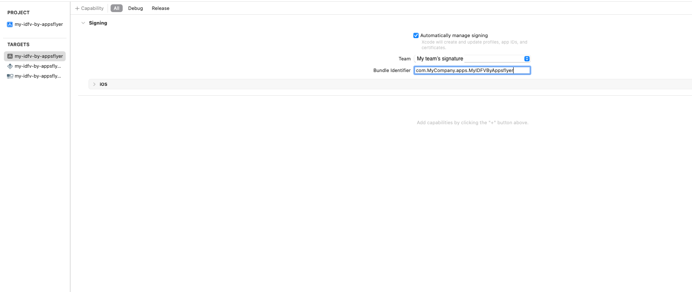

 

# My IDFV By Appsflyer

When registering a whitelisted iOS device in the AppsFlyer dashboard (LINKTO: https://hq1.appsflyer.com/test-devices/devices), the device is configured with either IDFA or IDFV. These unique identifiers are used to recognize the device as a whitelisted one.

If the device is registered with IDFA, it can only be identified as a whitelisted device if the app implements ATT (App Tracking Transparency) and the user gives consent during the testing process. However, if the app doesn’t implement ATT, you can use IDFV (ID for Vendor) as an alternative.

One important thing to keep in mind when using IDFV for testing is that it will reset every time you uninstall and reinstall the app, unless another app from the same vendor is installed on the device. This is where “My IDFV by AppsFlyer” comes in.

“My IDFV by AppsFlyer” is a utility app that you can install on a test device to maintain the IDFV across consecutive installs of the app. By doing so, you can use IDFV for testing without any concerns. 
This is done by changing the app’s bundle identifer to match the Bundle ID prefix of the app that you are testing, as explained in the How To section below.
## How to provision the app to your use:
To implement the white label app, follow these steps:

1. Clone the repo to your local machine.
2. Open Xcode and select the project in the Project Navigator.
3. Select the target for your app in the Targets section.
4. Click on the "Signing & Capabilities" tab and find the Bundle Identifier field.
5. Change the Bundle Identifier to a new, unique identifier that uses a prefix of the app you are trying to test. For example, if your app's Bundle Identifier is "com.MyCompany.apps.myapp", you should change the Bundle Identifier of “MyIDFVByAppsflyer” app into "com.MyCompany.apps.MyIDFVByAppsflyer".
6. Rebuild and re-install the app on the device.
Once the app is installed with the new Bundle Identifier, it will have a new IDFV associated with it. if you have already other apps you developed the new white label app will get the same IDFV as the others. Now by keeping this app, you ensure consistent testing across multiple versions of the app.

